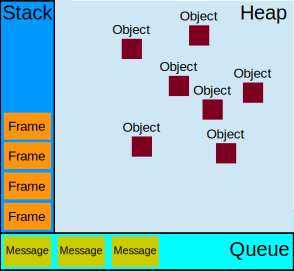

Figma uses webassembly

In C, _Atomic is used as a type specifier. It is used to avoid the race condition if more than one thread attempts to update a variable simultaneously. It is defined in the stdatomic. h header.

The DOM is not thread safe. It’s a tree and has a hierarchical structure

JavaScript uses the concept of Event Loop to handle async tasks, and offer a non-blocking behaviour, this allows JavaScript to be responsive in a non-blocking fashion despite being single-threaded.

JS uses a FILO (First In, Last Out) data structure for Stack

The callback queue is a FIFO (First In, First Out)
